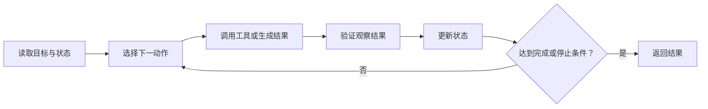

# 任务拆解与 Agent 工作流

> [!important] 一句话核心
> 只有单次模型调用无法可靠完成复合任务时才拆解；每个阶段必须有清晰输入、输出、完成条件和失败路径。

## 为什么拆解

拆解可以让系统：

- 隔离不同任务和提示规则。
- 为每一步选择不同模型、工具或 schema。
- 保存中间结果，定位失败来源。
- 在高风险动作前增加程序校验或人工审批。
- 并行处理彼此独立的材料。

但拆解也会增加调用次数、延迟、接口、状态和失败点。如果一个直接 prompt 已经可靠，就不需要为了“架构感”拆链。

## 四种基本模式

### Prompt Routing

先识别互斥任务，再调用专用流程。

```text
用户请求 → 分类为“查询 / 修改 / 退款” → 对应工作流
```

适用于不同任务需要不同工具、权限或输出契约的情况。路由标签应由 schema 限定，并为无法判断的输入保留 `needs_review`。

### Prompt Chaining

前一步输出是后一步的必要输入。

```text
文档抽取 → 事实校验 → 生成答复
```

每一步应只承担一个清晰职责。不要在链中悄悄丢失来源、未知值或约束。

### 并行后汇总

不同材料或子任务可独立处理，最后聚合。

```text
材料 A ─┐
材料 B ─┼→ 对照共同点、冲突和缺失
材料 C ─┘
```

适合多文档提取、独立候选生成或多维度评审。汇总阶段必须看到来源标识，不能把多数意见自动当事实。

### 生成后校验

先生成候选，再由独立规则、代码或审查步骤检查。

```text
生成 → Schema 校验 → 业务规则校验 → 发布
```

确定性检查优先由程序完成；第二次模型调用只处理真正需要语义判断的检查。

## 如何决定是否拆分

满足以下任一条件时，拆分通常有价值：

- 不同子任务具有不同成功标准。
- 某一步需要 tool、schema 或高风险授权。
- 中间结果需要独立审计、缓存或复用。
- 失败需要定位到具体阶段。
- 材料可以独立并行处理。
- 单步输出经 eval 证明不稳定。

以下情况通常不值得：

- 只是为了让 prompt 看起来模块化。
- 阶段之间没有清晰数据接口。
- 每一步都重复读取全部上下文。
- 没有保存和验证中间结果。
- 简单任务已经达到成功标准。

## 阶段契约

每个阶段复用 [[01-task-contract|任务契约]] 的简化形式：

```yaml
step: extract_claims
input: 带来源 ID 的文档集合
output: claims[]，每项包含 claim、source_id、evidence_span
success: 每条 claim 能追溯到原文
failure: 无证据时返回空列表和 missing_sources
side_effects: none
```

下一步只依赖声明的输出，而不是依赖上一轮模型的隐含想法。

## Agent 循环

常见 Agent 运行循环是：



循环必须有预算和停止条件，例如最大工具调用次数、时间、成本、重复失败次数或授权边界。持久性不等于无限重试。

## 失败恢复

发生失败时：

1. 保存已经完成的阶段和可复用中间结果。
2. 判断失败是输入、模型、tool、schema 还是权限问题。
3. 只重试可恢复的阶段，不从头重复整个流程。
4. 相同失败再次发生时改变假设或策略。
5. 达到停止条件后返回结构化失败和缺失信息。

工具与授权细节见 [[12-tools-state-and-authorization|工具、状态与授权边界]]。

## 并行化边界

可以并行：

- 互不依赖的只读检索。
- 不同文档的独立提取。
- 多个候选的独立评估。

不应并行：

- 后一步参数依赖前一步结果。
- 多个调用修改同一资源。
- 顺序会影响权限、余额或外部状态。
- 汇总阶段需要所有上游结果。

## 可观测性

每次运行至少记录：

- 工作流和 prompt 版本。
- 每个阶段的输入引用和输出状态。
- 模型、工具、参数和延迟。
- 重试、错误和停止原因。
- 授权事件和副作用结果。
- Eval 需要的最终标签。

不要默认保存敏感原始内容；日志应遵守数据治理和最小化原则。

## 常见误区

- **把内部推理当工作流**：工作流需要外部可检查状态和接口。
- **每一步都是自由文本**：下游难以验证和恢复。
- **链越长越可靠**：每个边界都新增传播错误的机会。
- **并行任务同时写同一资源**：容易发生竞争和不一致。
- **失败从头重跑**：成本高，还可能重复副作用。
- **没有停止条件**：Agent 会在不可恢复问题上循环。

## 检查表

- [ ] 单步 baseline 已证明不足。
- [ ] 每一步只有一个主要职责。
- [ ] 输入、输出、成功和失败可检查。
- [ ] 中间结果保留来源与未知值。
- [ ] 独立步骤才并行。
- [ ] 副作用步骤具有授权和幂等保护。
- [ ] 失败只重试必要阶段。
- [ ] 循环有成本、次数和停止预算。

## 相关笔记

- [[10-context-and-instruction-architecture|上下文与指令架构]]
- [[11-structured-output-and-determinism|结构化输出与确定性保证]]
- [[12-tools-state-and-authorization|工具、状态与授权边界]]
- [[14-evaluation-and-iteration|Prompt 评估与迭代]]

