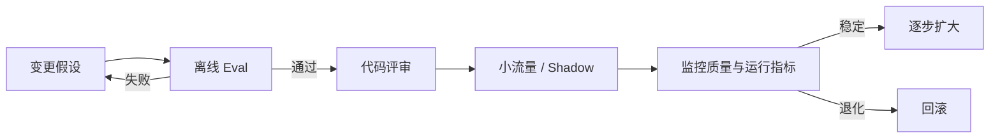

# Prompt 的生产生命周期

> [!important] 一句话核心
> 生产 prompt 应像代码和接口一样被版本化、测试、评审、发布、监控和回滚，而不是作为无人追踪的字符串散落在系统中。

## Prompt-as-Code

生产 prompt 至少应具有：

- 明确的名称和单一职责。
- 受版本控制的源文件。
- 类型化或经过验证的动态输入。
- 与 tool、schema 和模型配置的显式关联。
- 代表性 fixtures 和 eval。
- 变更说明、评审和回滚记录。

避免在业务代码、多处配置和运营后台中维护多个无法对照的副本。具体存储方式取决于平台，但必须有一个可追溯的发布来源。

## 版本单元

“Prompt 版本”不应只记录文本。一次可复现运行通常还需要：

```yaml
prompt_version: support-routing-v7
model: provider/model-snapshot
toolset_version: support-tools-v3
schema_version: routing-schema-v2
retrieval_version: kb-index-2026-07-15
runtime_config:
  temperature: provider_default
eval_suite: support-routing-regression-v5
```

如果这些部分同时变化，应分别记录，避免把回归错误地归因于 prompt。

## 发布流程



高风险应用还需要人工审批、审计和领域验证。上线方式应与业务影响匹配，不必为低风险内部工具构建过重流程。

## 监控什么

监控指标应与 [[14-evaluation-and-iteration|Eval]] 和任务契约保持一致：

- 任务完成率和人工接管率。
- 解析、schema 与业务校验失败率。
- Tool 选择、参数和执行成功率。
- 无依据断言、引用和安全违规。
- 延迟、token、费用和重试。
- 模型拒绝、截断和 fallback。
- 输入分布和错误类型漂移。

只监控 API 成功率无法发现语义质量退化。

## 回滚设计

发布前明确：

- 上一个稳定版本是什么。
- 哪些指标触发自动或人工回滚。
- Prompt、模型、schema 和 tool 是否能独立回滚。
- 新旧版本状态和数据是否兼容。
- 已执行的副作用如何处理。

回滚不是“把文本改回去”这么简单；接口和状态变化可能需要迁移策略。

## 模型升级

模型升级相当于更换运行时，不应假设旧 prompt 行为保持不变。

1. 固定当前模型、prompt 和 eval baseline。
2. 只更换目标模型运行同一测试集。
3. 分析能力、格式、tool、成本和延迟变化。
4. 只有模型差异确实导致失败时才调整 prompt。
5. 重新运行回归集和关键在线验证。
6. 保留旧模型或旧配置的回滚路径。

供应商模型专属建议会变化，应查当前官方资料，见 [[99-provider-guidance-and-sources|供应商指南与来源索引]]。

## 成本与延迟

优化顺序通常是：

- 删除无关和重复上下文。
- 缩短不必要的输出。
- 缓存稳定前缀或检索结果。
- 合并没有独立价值的模型调用。
- 并行执行真正独立的读取任务。
- 为不同任务选择合适模型。
- 只在必要阶段使用更高推理预算。

不要用牺牲任务正确性的方式追求 token 数，也不要用更长 prompt 解决本应更换模型或架构的问题。

## 安全与数据治理

生产生命周期还需覆盖：

- Prompt 和日志中是否包含秘密或个人数据。
- Retrieval 和 tool 是否遵守最小权限。
- 不可信内容是否可能影响高优先级指令。
- Tool 副作用是否需要确认、幂等和审计。
- 运行记录的保留期限和访问控制。
- 外部供应商的数据使用和区域要求。

这些是系统设计问题，不能只靠一句“遵守安全规则”。

## 变更评审清单

- [ ] 变更对应明确失败或需求。
- [ ] Prompt、schema、tool 和模型的变化分别列出。
- [ ] Fixtures 和 eval 已更新并通过。
- [ ] 没有引入无关重构或重复规则。
- [ ] 易变的供应商行为有来源和复查日期。
- [ ] 上线范围、监控和回滚条件明确。
- [ ] 成本、延迟、权限和数据影响已评估。
- [ ] 发布后能够定位到完整运行版本。

## 常见误区

- **Prompt 存在数据库就算版本化**：没有测试、评审和发布关联仍不可追溯。
- **只给 prompt 打版本号**：模型、tool、schema 变化同样影响行为。
- **升级模型时顺便重写 prompt**：无法判断差异来源。
- **只监控延迟和错误码**：语义退化不会自动暴露。
- **没有 feature flag 或旧版本**：发现回归后无法快速止损。
- **保留全部输入输出日志**：可能违反数据最小化要求。

## 相关笔记

- [[10-context-and-instruction-architecture|上下文与指令架构]]
- [[12-tools-state-and-authorization|工具、状态与授权边界]]
- [[13-decomposition-and-agent-workflows|任务拆解与 Agent 工作流]]
- [[14-evaluation-and-iteration|Prompt 评估与迭代]]

